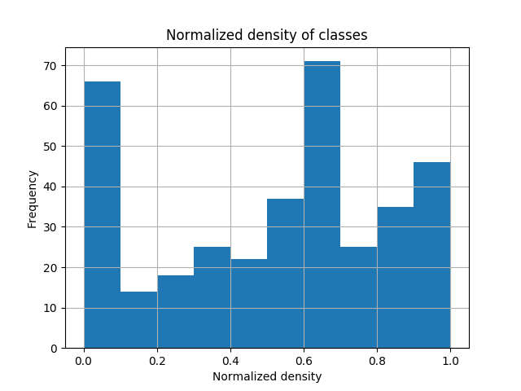
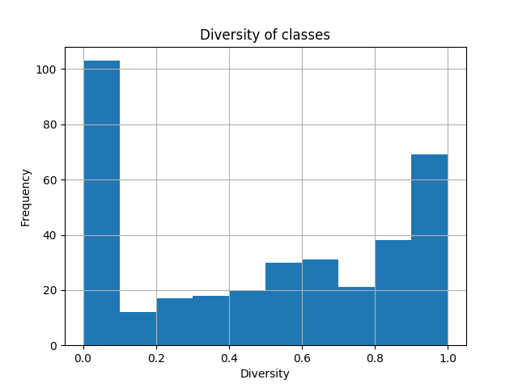
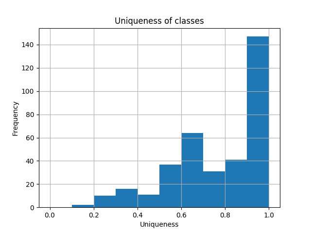
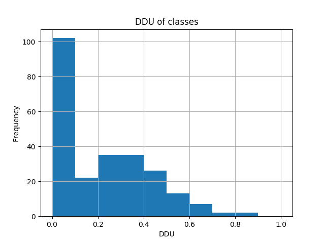

# Case Study

In this case study, we analyze a couple of real projects, hosted on GitHub, to get a better understanding of DDU.
More specifically, we are interested in how DDU is affected by different kinds of tests, e.g. unit tests, integration tests, acceptance tests, etc., and testing techniques like parameterized testing.
This knowledge could be used to guide developers in writing tests during the software development process.
Ultimately, the goal is to guide the developer in writing tests such that the diagnosability of the test suite improves.

In this section we first discuss the selection criteria that are used for selecting open source projects to analyze.
Secondly, we explain the approach for analyzing the impact of different kinds of tests on DDU.
Then, for each individual term of DDU, i.e. normalized density, diversity, and uniqueness, we give examples to clarify how the term changes with regards to related tests.
Subsequently, we discuss the DDU metric as a whole.
Finally, we conclude this case study with observations and recommendations.


## Selection

The selection of open source projects is done according to the following criteria.

- The project must have a executable test suite.

    To compute the DDU for a software project, we must construct an activity matrix, also known as program spectra.
    The program spectra is constructed by running the test suite and instrumenting the code such that we can keep track of what parts of the code are executed during a program execution.

- The project must use Apache Maven, a software project management and comprehension tool.

    The current tool that instruments the code to construct the activity matrix is implemented as a Maven plugin. Note that the current Maven plugin does not work for all Maven projects, and therefore only projects, that can be analyzed with this plugin, are used.

Based on these requirements, we choose the following open source projects.

- [Commons CSV](commons_csv.md): a library that provides a simple interface for reading and writing CSV files of various types.
- [Commons Text](commons_text.md): a library focused on algorithms working on strings.
- Commons IO: a library of utilities to assist with developing IO functionality.
- [Guice](guice.md): a lightweight dependency injection framework for Java 6 and above.
- [Jsoup](https://github.com/jhy/jsoup): an API for extracting and manipulating data, using the best of DOM, CSS, and jquery-like methods.


## Approach

To get a better understanding of how DDU varies as a consequence to testing, we use [`ddu-maven-plugin`](https://github.com/aperez/ddu-maven-plugin), written by Perez, to instrument Java code and collect the activity matrix.
The DDU Maven plugin is capable of computing the DDU, however it requires deeper knowledge if we would like to modify the plugin to use different granularities, e.g. class granularity.
Therefore, to compute the DDU, its individual terms, and the metrics for different granularities, we wrote multiple [Python scripts](https://github.com/aaronang/ddu/tree/master/analysis).
Note that class granularity is not supported by `ddu-maven-plugin`; it has support for instrumenting Java at method, block, and line granularity.

With these two tools we collect data for different granularities such as number of tests, number of unit tests, number of integration test, density, normalized density, diversity, uniqueness, DDU, and the activity matrix.
>**TODO: Revisit definition of unit and integration tests.**
>
>Since the definition of unit and integration tests varies from person to person, we use the following simple definition.
>At method granularity, a test is considered a unit test when it only covers one method.
>Accordingly, a test is considered an integration test when it covers two or more method.

Then, we analyze the collected data and show examples that illustrate how DDU and its individual terms vary as a consequence to particular kinds of tests.
We are interested in what kinds of tests result in a high or low DDU value.


## Normalized Density

In the figure below, we show the distribution of normalized densities for all classes of the four open source projects mentioned before.
The average equals to `0.5145`.
The peak for the interval `0.0 - 0.1` is caused by classes that only consist of one method.
A class with one method will always have a density of `1.0` and therefore a normalized density of `0.0`.



>**TODO: Show histogram without zeroes in a different (and overlapping) color.**

The normalized density value is low when a class is tested by many tests that only cover a couple of methods. 
For example, `org.apache.commons.csv.CSVRecord` has `17` methods (excluding its constructors) and its spectra looks as follows.
Note that not all transactions that hit `CSVRecord` methods are shown, but in the case of `CSVRecord`, all its transactions look similar; each transaction only hits a couple of components.

```
[1, 0, 0, 0, 0, 0, 0, 0, 0, 0, 0, 0, 0, 0, 0, 0, 0] CSVRecordTest#testGetStringNoHeader
[0, 0, 0, 0, 0, 0, 0, 0, 0, 0, 1, 0, 0, 0, 0, 0, 0] CSVRecordTest#testGetUnmappedPositiveInt
[0, 0, 0, 0, 0, 0, 0, 0, 0, 0, 1, 0, 0, 0, 0, 0, 0] CSVRecordTest#testGetUnmappedNegativeInt
[1, 0, 0, 0, 0, 0, 0, 0, 0, 0, 0, 0, 0, 1, 0, 0, 0] CSVRecordTest#testGetUnmappedEnum
[1, 0, 0, 0, 0, 0, 0, 0, 0, 0, 0, 0, 0, 0, 0, 0, 0] CSVRecordTest#testGetUnmappedName
```

In the partial spectra of `CSVRecord` shown above, the columns are the methods of `CSVRecord`.
So, for example, in the first row, we observe that the transaction `testGetStringNoHeader` only hits one method, indicated by a `1`.
The normalized density of `CSVRecord` is low because its test cases only cover a couple components and this causes the activity matrix to become sparse.
Thus, the more components a class has, the greater the impact of a test, that hits a relative small number of components, has on the sparseness of the activity matrix.

```
[1, 0, 1, 1, 1, 1] ImplicitBindingTest#testDefaultImplementation
[1, 0, 1, 1, 1, 1] ImplicitBindingTest#testProvidedByNonEmptyEnum
[1, 0, 1, 1, 1, 1] ImplicitBindingTest#testDefaultProvider
[1, 0, 1, 1, 1, 1] ImplicitBindingTest#testProvidedByEmptyEnum
[1, 0, 1, 1, 1, 1] ImplicitBindingTest#testImplicitJdkBindings
```

In the partial spectra of `com.google.inject.internal.ConstructorInjectorStore`, a Guice class, shown above, we observe a high density; almost all methods of `ConstructorInjectorStore` are hit in every single test.
Since the density is high: `0.8351`, the normalized density is low: `0.3298`.

So, ideally, to obtain a high value for the normalized density, we need a good balance between tests that cover many components and tests that cover a few.
In Commons Text, the `org.apache.commons.text.beta.StrLookup` class has a normalized density of `0.9512`.
In the partial spectra, shown below, we observe that each test case covers `50%` of the components and therefore this particular class obtains a density close to `0.5` and a normalized density close `1.0`.

```
[0, 1, 0, 1] StrLookupTest#testNoneLookup
[1, 1, 0, 0] StrLookupTest#testSystemPropertiesLookupReplacedProperties
[1, 1, 0, 0] StrLookupTest#testSystemPropertiesLookupUpdatedProperty
[0, 1, 1, 0] StrLookupTest#testMapLookup_nullMap
[0, 1, 1, 0] StrLookupTest#testMapLookup
```

In short, to obtain a good value for normalized density, we could suggest the developer to write tests that either cover many components, a few, or something in between based on the density.
If the density is lower than `0.5`, we could suggest the developer to write tests that cover many components.
If the density is higher than `0.5`, we could suggest the developer to write tests that cover a few components.
Either way, suggesting the developer to write tests that cover a certain number of components is probably not practical.


## Diversity

In the figure below, the distribution of diversity of classes are shown.
The average is `0.4813`.
The peak for the interval `0` and `0.1` occurs for various reasons.
The first reason is that there are classes with only one method and therefore every row is identical, resulting in a diversity of `0`.
The second reason is that for some classes there exist only one test case, and in the current Python script the diversity defaults to `0` when there is only one test case.

>**Note: Show overlapping histogram where classes with only one test case are filtered out.**



Intuitively, the diversity has a low value when the number of identical transactions, i.e. identical rows in the activity matrix, is high.
Vice versa, the diversity is high when the number of identical transaction activity is low.

```
[1, 0, 1, 0] org.jsoup.nodes.ElementTest#testCssPath
[0, 0, 1, 0] org.jsoup.nodes.ElementTest#testSetHtmlTitle
[0, 0, 1, 0] org.jsoup.nodes.ElementTest#moveByAppend
[0, 0, 1, 0] org.jsoup.nodes.ElementTest#testClassUpdates
[0, 0, 1, 0] org.jsoup.nodes.ElementTest#testAddNewElement
```

In the partial spectra of `org.jsoup.select.Evaluator` of Jsoup shown above, we observe that almost every transaction has an identical activity and therefore the diversity is low: `0.0901`.
Another reason for the low diversity of `org.jsoup.select.Evaluator` is that it is covered by `277` test cases, while there are only `2^4 = 16` possible different test cases.
After `16` unique test cases every additional test case will have a negative effect on the diversity because it will share similar activity with an existing test case.

```
[1, 1, 1, 1, 0, 0, 1, 1, 1, 1] MembersInjectorTest#testMembersInjectorFromBinder
[1, 1, 1, 1, 1, 1, 1, 1, 1, 0] ElementApplyToTest#testGetMembersInjector
[1, 1, 1, 1, 0, 1, 0, 1, 1, 0] ElementApplyToTest#testElementInitialization
[1, 1, 1, 0, 1, 0, 1, 1, 1, 0] ElementsTest#testGetMembersInjector
[1, 1, 1, 1, 0, 0, 0, 1, 1, 0] ElementsTest#testElementInitialization
[1, 1, 1, 1, 0, 0, 1, 1, 1, 0] TypeListenerTest#testLookupsAtInjectorCreateTime
[0, 1, 0, 1, 0, 0, 1, 1, 1, 0] TypeListenerTest#testConstructedTypeListenerIsTheSameAsMembersInjectorListener
[0, 1, 0, 0, 0, 0, 1, 1, 1, 0] TypeListenerTest#testInjectMembersTypeListenerFails
[1, 1, 1, 1, 1, 1, 1, 1, 1, 0] NoopOverrideTest#testGetMembersInjector
[1, 1, 1, 1, 0, 1, 0, 1, 1, 0] NoopOverrideTest#testElementInitialization
```

In the activity matrix of `com.google.inject.spi.MembersInjectorLookup`, a Guice class, shown above, we observe that almost every transaction has a unique activity and therefore its diversity is high.
Note that the diversity suffers when there are too many test cases, but does not suffer from a low number of test cases, i.e. a high diversity can be obtained with a couple unique system transactions.

```
[0, 1, 1, 0, 0] ParameterizedLevenshteinDistanceTest#test[0]
[0, 1, 1, 0, 0] ParameterizedLevenshteinDistanceTest#test[1]
[0, 1, 1, 0, 0] ParameterizedLevenshteinDistanceTest#test[2]
[0, 1, 1, 0, 0] ParameterizedLevenshteinDistanceTest#test[3]
[0, 1, 1, 0, 0] ParameterizedLevenshteinDistanceTest#test[4]
[0, 1, 1, 0, 0] ParameterizedLevenshteinDistanceTest#test[5]
[0, 1, 1, 0, 0] ParameterizedLevenshteinDistanceTest#test[6]
[0, 1, 1, 0, 0] ParameterizedLevenshteinDistanceTest#test[7]
[0, 1, 1, 0, 0] ParameterizedLevenshteinDistanceTest#test[8]
```

An interesting case for diversity is parameterized testing, shown in the partial spectra above.
The `LevenshteinDistance` spectra consists primarily of parameterized test and has a diversity of `0.3167`.
Although parameterized is a common practice to test different inputs for a unit, it has a negative effect on the diversity due to identical activity patterns.


## Uniqueness

In the figure below, the distribution of uniqueness of classes are shown.
The average is `0.7696`.



The peak for the interval `0.9 - 1.0` is caused by classes that only have one component; activity matrices that consist of one component always have a uniqueness of `1.0`.
More specifically, there are `130` classes that have a uniqueness of `1.0` and `47` out of the `130` only have one component.

```
[0, 0, 1, 0, 0, 1, 0, 0, 0, 0, 1, 0] CopyUtilsTest#testCopy_byteArrayToWriterWithEncoding
[0, 0, 0, 0, 0, 0, 0, 0, 0, 0, 1, 1] CopyUtilsTest#copy_stringToOutputStream
[0, 0, 0, 0, 0, 0, 0, 0, 1, 0, 1, 0] CopyUtilsTest#testCopy_readerToOutputStream
[0, 0, 0, 0, 0, 0, 0, 0, 0, 0, 1, 0] CopyUtilsTest#copy_readerToWriter
[0, 1, 0, 0, 0, 0, 0, 0, 0, 1, 1, 0] CopyUtilsTest#copy_byteArrayToWriter
[0, 0, 0, 0, 1, 0, 0, 0, 0, 0, 0, 0] CopyUtilsTest#copy_byteArrayToOutputStream
[0, 0, 1, 0, 0, 0, 0, 0, 0, 0, 1, 0] CopyUtilsTest#copy_inputStreamToWriterWithEncoding
[0, 1, 0, 0, 0, 0, 0, 0, 0, 0, 1, 0] CopyUtilsTest#copy_inputStreamToWriter
[0, 0, 0, 0, 0, 0, 1, 0, 0, 0, 0, 0] CopyUtilsTest#testCopy_inputStreamToOutputStream
[1, 0, 0, 0, 0, 0, 0, 0, 0, 0, 0, 0] CopyUtilsTest#copy_stringToWriter
[1, 0, 0, 0, 0, 0, 0, 0, 0, 0, 0, 0] IOUtilsTestCase#testCopy_String_Writer
[0, 1, 0, 0, 0, 0, 0, 0, 0, 1, 1, 0] IOUtilsTestCase#testCopy_ByteArray_Writer
[0, 0, 0, 0, 1, 0, 0, 0, 0, 0, 0, 0] IOUtilsTestCase#testCopy_ByteArray_OutputStream
[0, 0, 0, 0, 0, 0, 0, 0, 0, 0, 1, 1] IOUtilsTestCase#testStringToOutputStream
```

There are a couple ways to get a high uniqueness.
One of them is to write tests that only cover a couple components at a time.
An example of this approach is shown above; `org.apache.commons.io.CopyUtils` has a uniqueness of `0.9167`.

## DDU

In the figure below, the distribution of DDU of classes are shown.
The average is `0.2264`.




The individual terms should be multiplied together.     