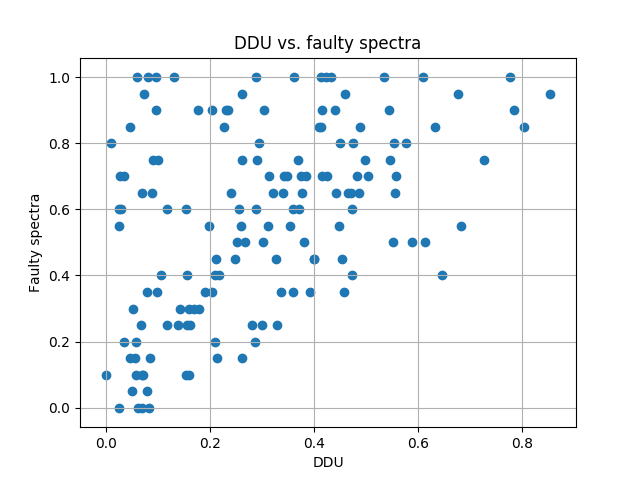
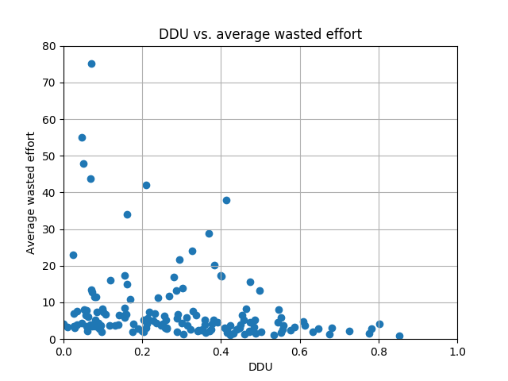
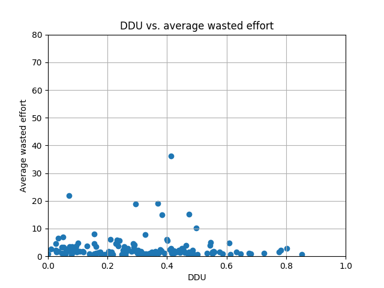

# Experiment

The goal of this experiment is to verify that DDU does indeed result in a better fault diagnosis.
Specifically, in this experiment, we would like to answer the two following questions:

>**TODO: The following questions must be rephrased more clearly.**

1. >Given a spectra and manually generated multiple component faults, does a higher DDU matrix identify more generated faults than matrices with a lower DDU? 

    The intuition behind the first question is that a matrix with a higher DDU will most likely have at least one failing transaction for any generated fault, and thus a better diagnosability.
    For example, in the matrix below, when the fault is `{c1, c2}` (a failure caused by multiple components), we obtain error vector `e1`.
    The failure that is caused by components `c1` and `c2` is not caught by the following test suite.
    However, when the fault is `{c1, c3}`, then we obtain error vector `e2`, which includes a failing transaction that is caught by the test suite.
    Since there are three components, there are only three possible multiple component faults of cardinality 2, namely `{c1, c2}`, `{c2, c3}`, and `{c1, c3}`.
    Given these three faults, the test suite is able to catch a failure in `33%` of the possible faults.

    ||c1|c2|c3|e1|e2|
    ---|---|---|---|---|---|
    t1|1|0|1|0|1|
    t2|0|1|0|0|0|
    t3|0|0|1|0|0|

    The hypothesis is that when the DDU of a test suite is high, then the percentage of diagnosable multiple component faults will be high.
    Vice versa, when the DDU of a test suite is low, then the percentage of diagnosable faults will be low.
    Note that we only consider multiple component faults.
    If we consider single component faults, the optimal activity matrix would be similar to an identity matrix.

2. >How is wasted effort related to DDU?

    The DDU metric was proposed to quantify the diagnosability of the test suite.
    Therefore, the hypothesis is that when the DDU is high, the average wasted effort will be low.
    Accordingly, when the DDU is low, the average wasted effort will be high.


## Approach

To answer the questions described above, we make use of five open source projects, namely: `commons-csv`, `commons-text`, `commons-io`, `guice`, `jsoup`.
First, we collect spectra for all classes that have at least `8` components, i.e. methods.
For each class spectra excluding its error vector we generate a random multiple component fault of cardinality `2`.
Then, we can compute for each transaction whether it fails or passes, i.e. compute the error vector.
We do this process of generating a fault and computing the error vector `20` times, resulting in `20` activity matrices with identical activity but different error vectors.
For each spectra and its corresponding newly computed error vector we check if the spectra contains a failing transaction.
Essentially, we check whether the test suite for a given class is able to catch any random fault.
Finally, we compute the percentage of generated fault that were caught by the test suite.

The second question can be answered by computing the average wasted effort for the twenty generated activity matrices, and average the average wasted efforts.
In addition, we compute the average of average wasted efforts only for activity matrices that have at least one failing transaction.
We use Barinel to perform fault diagnosis such that we can then compute the wasted efforts based on its output.

## Results



In the figure above, the percentage of faulty spectra, as a result of generating mulitple component faults, versus DDU is depicted.
We observe that the percentage of diagnosed faults has a lower bound.




```
Normal test DDU: NormaltestResult(statistic=7.3273763541672174, pvalue=0.025637781462839522)
Normal test effort: NormaltestResult(statistic=138.00513868313772, pvalue=1.0778663101659946e-30)
[Pearson] (-0.25710462112559301, 0.0016077619309242052)
[Spearman] SpearmanrResult(correlation=-0.37370732836400777, pvalue=2.8906415422469398e-06)
```



```
Normal test DDU: NormaltestResult(statistic=6.5147760360543288, pvalue=0.038488798886688429)
Normal test effort: NormaltestResult(statistic=171.49114626470001, pvalue=5.7699326120080337e-38)
[Pearson] (-0.016536620856091273, 0.84404398516532031)
[Spearman] SpearmanrResult(correlation=-0.12032342052563602, pvalue=0.15085399195027652)
```
