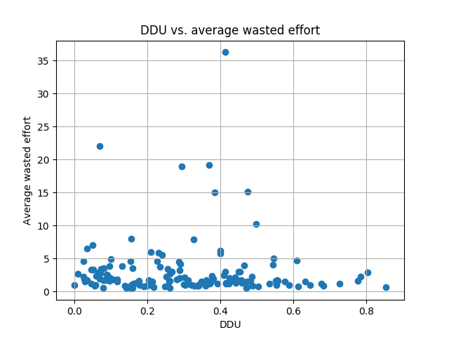

# Experiment

The goal of this experiment is to verify that DDU does indeed result in a better fault diagnosis.
Specifically, in this experiment, we would like to answer the two following questions:

>**TODO: The following questions must be rephrased more clearly.**

1. >Given a spectra and manually generated fault candidates that only cause a failure when executed together in a transaction, does a higher DDU matrix identify more generated fault candidates than matrices with a lower DDU? 

    The intuition behind the first question is that a matrix with a higher DDU will most likely have at least one failing transaction for any generated fault candidate, and thus a better diagnosability.
    For example, in the matrix below, when the fault candidate is `{c1, c2}` (a failure caused by multiple components), we obtain error vector `e1`.
    The failure that is caused by components `c1` and `c2` is not caught by the following test suite.
    However, when the fault candidate is `{c1, c3}`, then we obtain error vector `e2`, which includes a failing transaction that is caught by the test suite.
    Since there are three components, there are only three possible candidate sets of cardinality 2, namely `{c1, c2}`, `{c2, c3}`, and `{c1, c3}`.
    Given these three fault candidates, the test suite is able to catch a failure in `33%` of the possible candidate sets.

    ||c1|c2|c3|e1|e2|
    |---|---|---|---|---|---|
    |t1|1|0|1|0|1|
    |t2|0|1|0|0|0|
    |t3|0|0|1|0|0|

    The hypothesis is that when the DDU of a test suite is high, then the percentage of diagnosable fault candidates will be higher.
    Accordingly, when the DDU of a test suite is low, then the percentage of diagnosable fault candidates will be lower.

2. >How is wasted effort related to DDU in the case where the spectra includes failing transactions?

## Approach

1. Select activity matrices with at least `8` components.
1. For each matrix:
    1. Generate multiple candidate sets with a particular cardinality.
    1. For each candidate set:
        1. Generate modify error vector where health probability equals `0`.
        1. Generate activity matrix for Barinel.
        1. Compute effort.
    1. Average effort.

## Results

